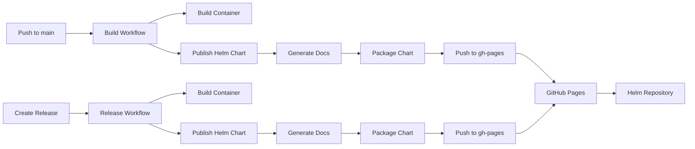

# Helm Chart CI/CD Setup Summary

## ✅ What's Been Added

### 1. **Integrated into Existing Workflows**

- **`.github/workflows/build.yml`**
  - Added `helm-publish` job for main branch
  - Automatically packages and publishes Helm charts
  - Updates versions with commit SHA (e.g., `0.1.0-abc1234`)
  - Publishes to GitHub Pages

- **`.github/workflows/release.yml`**
  - Added `helm-release` job for releases
  - Publishes stable version matching release tag
  - Updates Chart.yaml with release version

### 2. **How It Works**



## 🚀 Getting Started

### First Time Setup (Repository Admin)

1. **Create gh-pages branch**
   ```bash
   git checkout --orphan gh-pages
   git rm -rf .
   echo "Helm repository" > README.md
   git add README.md
   git commit -m "Initial gh-pages"
   git push origin gh-pages
   ```

2. **Enable GitHub Pages**
   ```
   Settings → Pages → Source: gh-pages branch → Save
   ```

3. **Push to main branch**
   The first push to main after setup will initialize the Helm repository

### Publishing Charts

**Automatic (Development)**
```bash
# Any change to helm/ directory on main branch
git add helm/
git commit -m "Update Helm chart"
git push origin main
# Creates version like: 0.1.0-abc1234
```

**Release Version**
```bash
# Create a GitHub release with tag v1.0.0
# Automatically creates chart version: 1.0.0
```

### Using Published Charts

```bash
# Add repository (after setup)
helm repo add event-exporter https://blaxel-ai.github.io/kubernetes-event-exporter
helm repo update

# Install
helm install my-exporter event-exporter/kubernetes-event-exporter
```

## 📋 Version Management

| Event | Chart Version | App Version | Example |
|-------|---------------|-------------|---------|
| Push to main | `{version}-{sha}` | `latest` | `0.1.0-abc1234` |
| Release `v1.2.3` | `1.2.3` | `1.2.3` | `1.2.3` |

## 🔍 Troubleshooting

**Chart not showing up?**
- Wait 5-10 minutes for GitHub Pages
- Check: `https://blaxel-ai.github.io/kubernetes-event-exporter/index.yaml`
- Verify workflow completed successfully

**Need to test locally?**
```bash
cd helm
helm package kubernetes-event-exporter
helm install test ./kubernetes-event-exporter-*.tgz --dry-run
```

## 📝 Important Notes

1. **Never commit AWS credentials** to values files
2. The workflow handles all version updates automatically
3. GitHub Pages URL is based on your GitHub username/org
4. First setup requires admin permissions

## 🔗 Quick Links

- [Helm Chart README](./kubernetes-event-exporter/README.md)
- [Publishing Guide](./kubernetes-event-exporter/PUBLISHING.md)
- [Example Values](./kubernetes-event-exporter/values.eventbridge.example.yaml) 