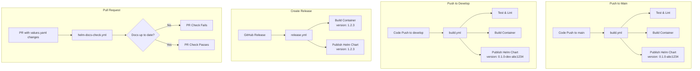

# Integrated CI/CD for Helm Charts

## Overview

The Helm chart publishing has been integrated into the existing CI/CD workflows rather than having separate workflows. This simplifies the CI/CD pipeline and ensures Helm charts are published alongside container images.

## What Changed

### ✅ Integrated Workflows

1. **`.github/workflows/build.yml`**
   - Added `helm-publish` job that runs on main and develop branches
   - Publishes development versions:
     - Main branch: `0.1.0-abc1234`
     - Develop branch: `0.1.0-dev-abc1234`
   - Runs after successful build and test

2. **`.github/workflows/release.yml`**
   - Added `helm-release` job for GitHub releases
   - Publishes stable versions matching release tags
   - Runs alongside container image release

3. **`.github/workflows/helm-docs-check.yml`**
   - Kept for PR validation
   - Ensures values documentation is up to date

### ❌ Removed Workflows

- `helm-chart.yml` - Functionality moved to build.yml and release.yml
- `setup-github-pages.yml` - Manual setup documented in README

## How It Works



## Benefits

1. **Simpler CI/CD**: One workflow per trigger event
2. **Consistency**: Helm charts and containers published together
3. **Version Alignment**: Chart versions match container tags
4. **No Manual Steps**: Everything automated on push/release

## Initial Setup

Since we removed the setup workflow, initial GitHub Pages setup is manual:

```bash
# One-time setup for gh-pages branch
git checkout --orphan gh-pages
git rm -rf .
echo "Helm repository" > README.md
git add README.md
git commit -m "Initial gh-pages"
git push origin gh-pages
git checkout main

# Then enable GitHub Pages in repository settings
```

## Version Strategy

| Trigger | Container Tag | Helm Chart Version |
|---------|--------------|-------------------|
| Push to main | `latest` | `0.1.0-${SHA}` |
| Push to develop | `latest-preview` | `0.1.0-dev-${SHA}` |
| Release v1.2.3 | `1.2.3` | `1.2.3` |

## Usage

No changes for developers:
- Push to main → Development chart published automatically
- Push to develop → Development chart with `-dev-` prefix published automatically
- Create release → Stable chart published automatically
- Update values.yaml → Run `make docs` before committing 